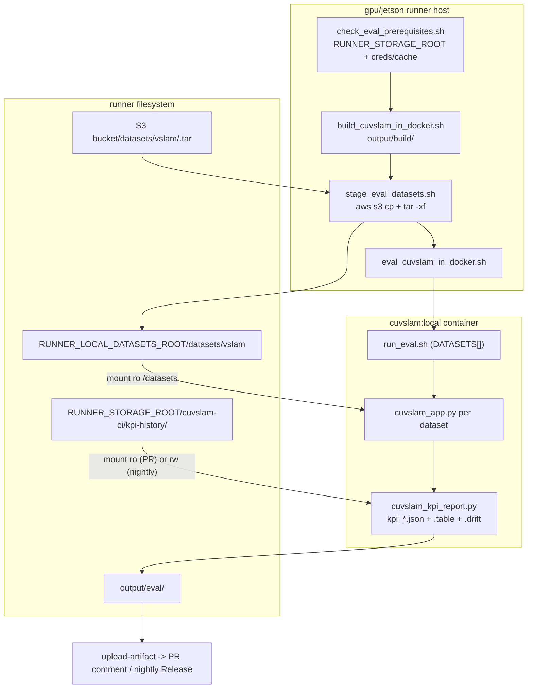

# cuVSLAM CI/CD Reference

Architecture, configuration, and constraints for the CI/CD pipelines. Task
playbooks are in [SKILL.md](SKILL.md).

## Goals

- Catch tracking-accuracy regressions on every PR (x86 eval) and track per-config KPI drift over time in nightly.
- Keep benchmark datasets private while the conversion scripts stay public: dataset blobs live in S3 and only provisioning writes them.
- Keep the runner footprint minimal: runners need Docker and the GPU runtime; all host tooling (AWS CLI, Python, pre-commit, jq) comes from the `cuvslam-ci:local` image built per job.

## Pipelines

- `pr-verify.yml`: lint in the CI image, then build + unit test on x86 (fork-gated), Orin, and Thor. The x86 job stages datasets, runs eval, and posts a KPI table to the PR comment. A status job aggregates the required checks.
- `nightly.yml`: build + test matrix across four x86 CUDA/Ubuntu configs plus Orin and Thor. Every config runs eval (`eval: true`). A GitHub-hosted release job assembles the nightly Release with a combined KPI table and per-config report assets.
- `provision-datasets.yml`: manual `workflow_dispatch`, gated to the default branch. Builds the CI image, runs `provision_dataset.sh` for the chosen dataset, uploads `<name>.tar`. The only writer of dataset storage.
- `sync-rulesets.yml`: applies `.github/rulesets/default-branch-ruleset.json` through the GitHub API using `RULESET_ADMIN_TOKEN`, on push to the ruleset path, weekly, and on demand.

## Eval data flow

## Secrets and variables

Repository variables:

- `S3_DATASETS_BUCKET` - dataset tarball prefix, kept out of source so the public repo does not expose the bucket.
- `AWS_DEFAULT_REGION`.
- `AWS_CLI_PUBLIC_KEY` - PGP public key block; the CI image GPG-verifies the AWS CLI installer against it at build time.
- `RUNNER_STORAGE_ROOT` - root of the runner storage mount; KPI history is at `<root>/cuvslam-ci/kpi-history`.
- `RUNNER_LOCAL_DATASETS_ROOT` (optional) - local extract root; default `$HOME/.cache/cuvslam`.

Repository secrets, split read from write so fork-reachable jobs never hold a key that can overwrite datasets:

- `AWS_S3_RO_ACCESS_KEY_ID` / `AWS_S3_RO_SECRET_ACCESS_KEY` - read-only S3; eval staging in `pr-verify.yml` and `nightly.yml`. Passed as `AWS_ACCESS_KEY_ID` / `AWS_SECRET_ACCESS_KEY`.
- `AWS_S3_ACCESS_KEY_ID` / `AWS_S3_SECRET_ACCESS_KEY` - read-write S3; `provision-datasets.yml` only.
- `RULESET_ADMIN_TOKEN` - used by `sync-rulesets.yml` to apply branch rulesets.

## Dataset registry and layout

- `PROVISIONABLE_DATASETS` (datasets the Provision workflow can build) and `EVAL_DATASET_NAMES` (datasets eval stages) live in `datasets_config.sh`.
- `run_eval.sh` `DATASETS[]` records are pipe-delimited: `LABEL|link_name|subdir|test_config|app_flags`. KITTI is active; the others are commented until provisioned.
- Tarball: uncompressed `<name>.tar` at `<S3_DATASETS_BUCKET>/<name>.tar`. Staged to `<RUNNER_LOCAL_DATASETS_ROOT>/datasets/vslam/<name>/` and mounted read-only into the eval container at `/datasets`. An ETag file skips re-download when the cache is current.

## KPI outputs

- Per run: `kpi_<run_id>.json` (raw), `kpi_<run_id>.json.table` (Markdown), `kpi_<run_id>.json.drift` (soft check vs `kpi_baseline_ranges.json`). KPIs are ATE, ARE, Kabsch, tracking losts, and FPS, in ODOM and SLAM modes.
- Nightly: one combined table with a leading `Config` column (`platform-cuda-ubuntu`); per-config `eval-kpis-<slug>` and `eval-html-report-<slug>` artifacts; KPI history per config at `<RUNNER_STORAGE_ROOT>/cuvslam-ci/kpi-history/<slug>/`. `RUN_ID` is the UTC date.
- PR: a single table labeled with `EVAL_CONFIG`; `RUN_ID=pr-<number>`; KPI history mounted read-only, so PR runs never write the baseline.

## Constraints

- Fork isolation: eval and dataset steps run only where `head.repo == github.repository`. Fork code never reaches dataset runners.
- Credential split: eval steps pass the read-only `AWS_S3_RO_*` pair; only provisioning uses the read-write `AWS_S3_*` pair.
- Per-config namespacing: KPI history directories and eval artifact names carry the `platform-cuda-ubuntu` slug. Artifact names are immutable in `upload-artifact@v7`, so a multi-config run requires per-config names to avoid an upload collision, and per-config history directories keep each config's diff-vs-previous lineage correct.
- Uncompressed `.tar`: gzip was dropped to cap memory on the provisioning runner. Packing (`provision_dataset.sh`) and extraction (`stage_eval_datasets.sh`) stay gzip-free and consistent.
- KPI history publish uses a direct copy: the S3-backed history mount does not implement `rename(2)`, so `run_eval.sh` copies the KPI JSON straight to the target rather than staging to `.tmp` and `mv`.
- Fail-fast on `RUNNER_STORAGE_ROOT`: the nightly eval step errors if it is unset rather than building a filesystem-root path; `check_eval_prerequisites.sh` also requires it.
- Runner requirements: every eval runner (x86 and Jetson) needs the `RUNNER_STORAGE_ROOT` mount and the `aws` CLI. `check_eval_prerequisites.sh` runs on the host and reads the credentials and CLI there.
- Change isolation: ruleset, CODEOWNERS, and `.github/workflows/**` changes go in their own MR, enforced by the `isolated-ruleset-change` pre-commit hook. Use the `[infra]` MR prefix.

## Learnings

- Thor has surfaced a GitHub runner-agent `set_output` / node24 failure during checkout, independent of this wiring; watch the first Thor eval run.
- `EVAL_CONFIG` in `pr-verify.yml` is a static label matching the build script defaults (CUDA 12.6.3 / Ubuntu 24.04). Update it if those defaults change, or pin the PR build's `CUDA_VERSION` / `UBUNTU_VERSION` so the label cannot drift.
- The AWS CLI and the scripts read `AWS_ACCESS_KEY_ID` / `AWS_SECRET_ACCESS_KEY` (standard names). The `AWS_S3_*` strings in script error messages name the repository secrets to configure, not env vars the scripts read.
