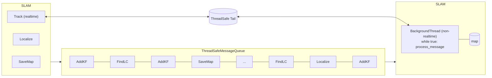
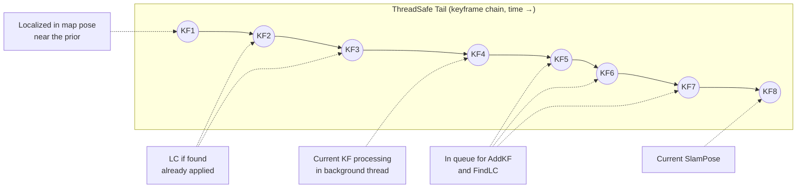

# Load map under the hood (Mermaid)

Diagrams referenced from [load_map.md](load_map.md).

## System overview

## ThreadSafe tail (keyframe chain)

---

Copyright (c) 2026, NVIDIA CORPORATION. All rights reserved.
